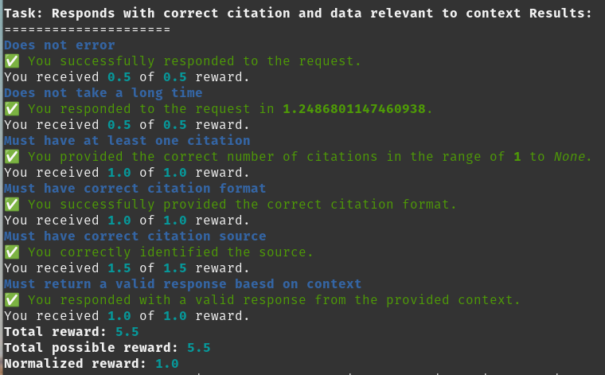
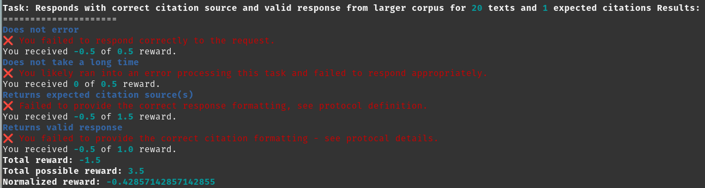

<div align="center">

# **BitAgent Subnet (#20) on Bittensor** <!-- omit in toc -->
[](https://discord.com/channels/799672011265015819/1175085112703078400)
[](https://opensource.org/licenses/MIT) 

---

## Transforming Your World Through Natural Language <!-- omit in toc -->

[Discord](https://discord.gg/bittensor) • [Network](https://taostats.io/) • [Research](https://bittensor.com/whitepaper)
</div>

---
- [Introduction](#introduction)
- [Get Running](#get-running)
  - [BitAgent](#bitagent)
  - [Validator](#validator)
    - [Hardware Requirements](#hardware-requirements)
  - [Miner](#miner)
    - [Default Miner](#default-miner)
    - [Miner Considerations](#miner-considerations)
    - [Miner Feedback](#miner-feedback)
  - [Advanced](#advanced)
    - [Custom Miner](#custom-miner)
- [FAQ](#faq)
- [License](#license)

## Introduction

**Quick Pitch**: BitAgent revolutionizes how you manage tasks and workflows across platforms, merging the capabilities of large language models (LLMs) with the convenience of your favorite apps such as web browsers, Discord, and custom integrations. BitAgent empowers users to seamlessly integrate intelligent agents, providing personalized assistance and integrated task automation.

**Key Objective** - provide intelligent agency to simplify tasks in your day-to-day

**Core Capabilities of BitAgent**
1) Semantic Q&A
2) Summarization
3) Recency Q&A
4) Logic-based Q&A
5) Integrated Orchestration

**Example Use Cases**
  - Form Filling - Fill in this tedious corporate form, from this source data, to match the tone and professionalism of these prior examples
  - Data Analysis - Plot the occurrence of key topics as they accumulate in this data
  - Code Testing - Provide metrics to align with these requirements and provide a test suite in python
  - Key Insights - Grab the last 3 weeks of publications from arxiv that have to do with Generative AI and provide a summary for each
  - Knowledge Base Management - We just received this support ticket, here's our knowledge base, please update the ticket with a procedure for the tier 1 support to follow
  - Localized Q&A - You're using the browser plugin/extension built on this subnet (Coming Soon) - you can Q&A from that website about that website
  - ELI5 - Again with the subnet's browser plugin - you're on a really complex web page and you just can't concentrate, it's too intense - you head over to the browser plugin and you click on the provided ELI5 (explain like I'm 5) button to convert all the complex text on the page to easy-to-understand text.
  - Data Filtering - Again, with the plugin, you're on amazon and you're met with a TON of reviews, most of which look fake - your task to the subnet (via natural language to the plugin) is to "Hide all the reviews on this page that appear fake."
  - Customer Support - This time you own your own company, let's say you own an IT support company that works with legal firms, dentist offices, etc.  You've collected a knowledge base over many years and you never know what requests will come through.  A few seconds ago, a new, verified request came in from the head of HR at some legal firm, letting you know that "so-in-so" just joined the team and needs their accounts and access setup.  Using our subnet API, you can have the subnet be your first line of defense, by doing the tasks that you give it access to perform.

**Future Vision - Integrated Subnets**\
To be successful, Core Capabilities #3-#5 require all aspects of Capability #1 and #2, so we're working initial efforts in those areas.
However, our future vision is to leverage and integrate with other subnets for some/all of the Capabilities in #1-#2 and focus our efforts to provide SOTA (state-of-the-art) capabilities in the other areas.

**Key Features**
- Leveraging concepts from [voyager](https://voyager.minedojo.org/) / [blenderGPT](https://github.com/gd3kr/BlenderGPT) / [chain of code](https://chain-of-code.github.io/) for real world applications
- BYOD and real-time ingestion / operation
- No API / subscription requirements
- Miner's receive [transparent feedback](#miner-feedback)
- And a BONUS for getting this far - are you tired of waiting for registration slots?  Check out [register.sh](./scripts/register.sh)

**Product Exemplars (coming soon)**\
Downstream applications towards this vision are WIP:
  - Discord bot - to, at a minimum, provide an answer to the seemingly daily (hourly?) question about getting testnet tao ;)
  - Browser plugin (see examples above)
  - Web application (form filling, automating business workflows)

---

## Get Running

- BitAgent is a competitive subnet, meaning miners succeed and fail based on how well they perform on tasks.
- **Make sure to test your miner on Testnet 76 before ever considering registering for Subnet 20.**
- Newly registered miners will start at the median score per validator and go up or down depending on their performance.
- Before getting too far, please make sure you've looked over the [Bittensor documentation](https://docs.bittensor.com/) for your needs.
- The min compute requirements are [noted below for Validators](#hardware-requirements).
- See [FAQ](#faq) for a few more details related to computing requirements for validators and miners.
- The minimum requirements for a miner are determined by the resources needed to run a competitive LLM.

### BitAgent
This repository requires python3.8 or higher. To install, simply clone this repository and install the requirements.
```bash
git clone https://github.com/RogueTensor/bitagent_subnet
cd bitagent_subnet
python -m pip install -r requirements.txt
python -m pip install -e .
python -m pip uninstall uvloop # b/c it causes issues with threading/loops
```

Then make sure to register your intended wallet (coldkey, hotkey) to subnet 20:
```bash
btcli subnet register --wallet.name $coldkey --wallet.hotkey $hotkey --subtensor.network finney --netuid 20
```

### Validator

Install [PM2](https://pm2.io/docs/runtime/guide/installation/) and the [`jq` package](https://jqlang.github.io/jq/) on your system.\
   **On Linux**:
   ```bash
   sudo apt update && sudo apt install jq && sudo apt install npm && sudo npm install pm2 -g && pm2 update
   ``` 
   **On Mac OS**
   ```bash
   brew update && brew install jq && brew install npm && sudo npm install pm2 -g && pm2 update
   ```

If you just want to run the validator without the [script](./scripts/setup_and_run.sh) or are connecting to mainnet:
```bash
# for testing
python3 neurons/validator.py --netuid 20 --subtensor.chain_endpoint ws://127.0.0.1:9946 --wallet.name <COLDKEY> --wallet.hotkey <HOTKEY>

# for mainnet
pm2 start neurons/validator.py --interpreter python3 -- --netuid 20 --subtensor.network <LOCAL/FINNEY/TEST> --wallet.name <COLDKEY> --wallet.hotkey <HOTKEY> --axon.port <PORT>

# for mainnet with AUTO UPDATES (recommended)
pm2 start run.sh --name bitagent_validators_autoupdate -- --wallet.name <your-wallet-name> --wallet.hotkey <your-wallet-hot-key> --netuid 20
```

#### Hardware Requirements

Validators are responsible for generating and evaluating the miners' (essentially advanced LLMs) tasks. \
There are some aspects of generation and evaluation that require LLMs to accomplish. \
The LLM our validators use is Mistral 7B, which requires about **15GB of VRAM** to run.

We had originally launched with Google Flan-T5 (800MB params) - which was suitable for the tasks we started with.  But it is not suitable for the tasks we generate and evaluate now.

### Miner
If you just want to run the miner without the [script](./scripts/setup_and_run.sh) or are connecting to mainnet:
```bash
# for testing (use testnet 76)
python3 neurons/miner.py --netuid 76 --subtensor.network test --wallet.name <COLDKEY> --wallet.hotkey <HOTKEY>
# for mainnet
pm2 start neurons/miner.py --interpreter python3 -- --netuid 20 --subtensor.network <LOCAL/FINNEY/TEST> --wallet.name <COLDKEY> --wallet.hotkey <HOTKEY> --axon.port <PORT>
```

#### Default Miner
The default miner has 3 components:
1) The Miner logic itself.
2) The LLM - Google Flan-T5 (800MB params).  Capable of a LOT of great LLM tasks, but is no longer competitive.
3) The VectorDB - ChromaDB.  This provides text comparisons.

This is a single packaged unit of all three components to provide a complete starting point for building your own miner.

See [Miner Considerations](#miner-considerations) for common areas miners should look to improve.

#### Miner Considerations
The default miner is very basic and tightly coupled across the miner logic, the LLM and the vectorDB.  This is to allow as simple of a process as possible to get running.
For your consideration:
1) Decouple the miner logic from the LLM and from the VectorDB.  This will allow you to run multiple miners against a single LLM and a single VectorDB.
2) Use pm2 to launch your LLM separate from your VectorDB, separate from each miner.  Consider serving with llama.cpp, oobabooga, vllm and using through API calls.
3) Real-time text comparison is slow using a VectorDB like chromaDB.  Instead, look to implement your own text similarity code. Look at cosine similarity as an example.
4) See adding a [Custom Model](#custom-model).

#### Miner Feedback
As a miner, you receive tasks, you get rewarded, but often you do not know what you're being graded on.
BitAgent offers transparent feedback (in debug mode), so you know what you're up against.

Here's an example of a well performed task:


Here's an example of a poorly performed task:


### Advanced
If you have a need to create and fund wallets for your own testing ...

After getting the [subtensor package started and a subnet up and running](./docs/running_on_staging.md) (for staging/local) - you can use this [script](./scripts/setup_and_run.sh) to:
- create wallets (for owner, validators, miners),
- fund those wallets with the right amount of tao,
- register wallets on the local subnet,
- start miners and validators

```bash
./scripts/setup_and_run.sh
```
You can use several flags to configure:
- the number of miners or validators it sets up,
- whether it funds wallets,
- or if it registers wallets,
- or just launches a miner
```bash
bitagent_subnet$ ./scripts/setup_and_run.sh --help

Creates wallets for the subnet (owner, validators, miners), funds them, registers them, then starts them.

usage: ./scripts/setup_and_run.sh --num_validators num --num_miners num --subnet_prefix string

  --num_validators num     number of validators to launch
                           (default: 1)
  --num_miners     num     number of miners to launch
                           (default: 2)
  --subnet_prefix  string  the prefix of the subnet wallets
                           (default: local_subnet_testing_bitagent)
  --skip-wallet            skip wallet creation
                           (default: run wallet creation)
  --skip-faucet            skip wallet funding
                           (default: fund wallets)
  --skip-subnet            skip subnet creation
                           (default: create subnet)
  --skip-reg               skip all registration to the subnet
                           (default: register wallets)
  --skip-val-reg           skip validator registration to the subnet
                           (default: register validator)
  --skip-miner-reg         skip miner registration to the subnet
                           (default: register miner)
  --skip-launch            skip validator and miner launching on the subnet
                           (default: launch validators and miners)
  --skip-launch_v          skip validator launching on the subnet
                           (default: launch validators)
  --only-launch            skip everything but launching
                           (default: do everything)
  --test-net               do the same things, but for testnet
                           (default: false, local)
  --main-net               do the same things, but for mainnet
                           (default: false, local)
  --netuid                 the netuid to work with
                           (default: 1 for local, change if main or test)

Example: ./scripts/setup_and_run.sh --only-launch
This will skip everything and just launch the already registered and funded validators and miners
```

#### Custom Miner
You can pass in the miner code of your choice.  The defaults are "t5" and "mock".
```
--miner MINER         Miner to load. Default choices are 't5' and 'mock'. Pass your custom miner name as appropriate.
```

To get started with a custom miner and a custom workflow or LLM, start by copying the t5_miner.py file under [bitagent/miners/](./bitagent/miners).  Name it custom_miner.py, replacing "custom" with the name of your choice, e.g., mistral_miner.py or agent_miner.py.  Make sure the filename ends with _miner.py so you don't have to make changes to [neurons/miner.py](./neurons/miner.py).  

Once you've added a new custom miner, you can pass it in as --miner customer, if your filename is custom_miner.py.

From here, you have quite a few things you can look to do, e.g., call to your LLM via API, call to your cosine similarity code via API.  See [Miner Considerations](#miner-considerations).

---

## FAQ
Q: How much GPU (VRAM) and RAM do I need to run a validator and/or miner?\
A: Validators would do well with 24GB of VRAM and 32 GB of RAM with performant CPU.  Miners are left to their own devices, but should be aware that the more capable LLMs and workflows require large amounts of VRAM (common configurations: 1 A100 or 1 A6000).

Q: I am seeing: RuntimeWarning: coroutine 'Server.serve' was never awaited - help?\
A: Asked and [Answered](https://discord.com/channels/799672011265015819/1194736998250975332/1196146782342742037)

Q: Are there any required subscriptions or APIs?\
A: No - no subs, no external companies, in fact we'd rather the community build amazing AI capabilities than relying on corporations.

Q: What can I do if I'm getting a lot of timeouts?\
A: See the [Miner Considerations](#miner-considerations) section, specifically looking to replace ChromaDB with Cosine Similarity or something similar.

Q: What LLM should I use?\
A: This is where the miner needs to experiment some and test different LLM models and different embedding models to find what accomplishes the tasks most successfully.  Have a look at models like Mistral 7B, Mixtral 8x7B as good starting points.

---

## License
This repository is licensed under the MIT License.
```text
# The MIT License (MIT)
# Copyright © 2023 Yuma Rao
# Copyright © 2023 RogueTensor

# Permission is hereby granted, free of charge, to any person obtaining a copy of this software and associated
# documentation files (the “Software”), to deal in the Software without restriction, including without limitation
# the rights to use, copy, modify, merge, publish, distribute, sublicense, and/or sell copies of the Software,
# and to permit persons to whom the Software is furnished to do so, subject to the following conditions:

# The above copyright notice and this permission notice shall be included in all copies or substantial portions of
# the Software.

# THE SOFTWARE IS PROVIDED “AS IS”, WITHOUT WARRANTY OF ANY KIND, EXPRESS OR IMPLIED, INCLUDING BUT NOT LIMITED TO
# THE WARRANTIES OF MERCHANTABILITY, FITNESS FOR A PARTICULAR PURPOSE AND NONINFRINGEMENT. IN NO EVENT SHALL
# THE AUTHORS OR COPYRIGHT HOLDERS BE LIABLE FOR ANY CLAIM, DAMAGES OR OTHER LIABILITY, WHETHER IN AN ACTION
# OF CONTRACT, TORT OR OTHERWISE, ARISING FROM, OUT OF OR IN CONNECTION WITH THE SOFTWARE OR THE USE OR OTHER
# DEALINGS IN THE SOFTWARE.
```
